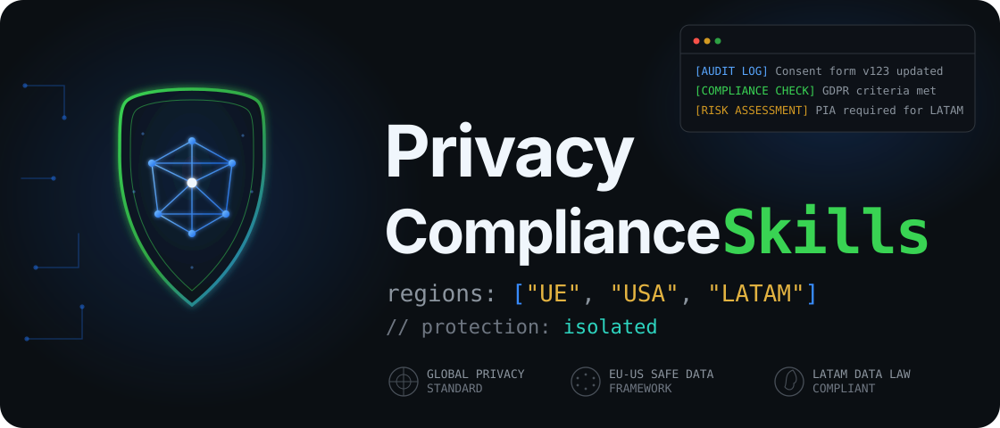
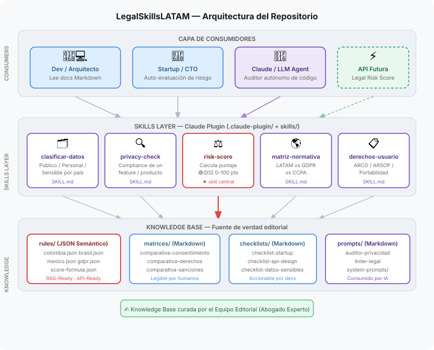
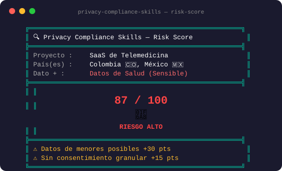

<p align="center">
  
</p>

<p align="center"><strong>Estándar abierto de cumplimiento de privacidad para desarrolladores — Compliance-as-Code</strong></p>

<p align="center">

[](LICENSE)
[](docs/SECURITY.md)
[](docs/ROADMAP.md)
[](#-cobertura-regulatoria)

</p>

<p align="center">
    
    
</p>

> ⚠️ Este proyecto es una guía metodológica y operativa. **No constituye ni suplanta asesoría jurídica profesional.** Consulta siempre con un abogado experto ante dudas legales específicas.

> 🌐 **Read this in English → [`README.en.md`](README.en.md)**

> 📛 **Antes se llamaba `LegalSkillsLATAM`.** El proyecto se renombró a **Privacy Compliance Skills (UE · USA · LATAM)** al elevar la Unión Europea y Estados Unidos a jurisdicciones de primer nivel. Ver [`PLAN-REBRAND-Y-WEB-2026-07.md`](PLAN-REBRAND-Y-WEB-2026-07.md).

---

## ¿Qué es?

**Privacy Compliance Skills** es un paquete de herramientas de cumplimiento de privacidad (*Compliance-as-Code*) para que desarrolladores de software y startups construyan tecnología conforme a las leyes de protección de datos de los **tres bloques regulatorios que más importan hoy**: la **Unión Europea** (GDPR), **Estados Unidos** (CCPA/CPRA + leyes estatales) y **Latinoamérica** (Ley 1581, LFPDPPP, LGPD y las demás).

Nació como recurso LATAM-first y hoy es un **estándar tri-regional**: compara las normativas locales entre sí y contra los marcos más exigentes del mundo, para que un producto pueda escalar de LATAM a Europa o EE.UU. sin reescribir su arquitectura de privacidad.

El proyecto opera en **tres formatos simultáneos**:

| Formato | ¿Para quién? | ¿Dónde está? |
|---|---|---|
| 📄 **Humanos** | Abogados, devs, CTOs | Matrices y checklists en `knowledge/` |
| 🤖 **IA** | Claude y otros LLMs | Skills instalables en `skills/` |
| ⚙️ **Máquinas** | APIs, CI/CD | Reglas JSON en `cli/rules/` |

---

## Estado actual

> 🔨 **Lo que ya funciona bien**
>
> El motor técnico está consolidado: las skills de Claude, la CLI con output visual, el algoritmo de Legal Risk Score (0–100), las reglas JSON por jurisdicción, los dos pilares Frontend/Backend y la arquitectura del repositorio. El bloque **LATAM está maduro** y el de la **UE (GDPR) está a nivel de producción**.
>
> 🚧 **Lo que está en construcción: el bloque USA**
>
> Con el rebrand, **Estados Unidos pasa de "contraste" a primer nivel**: se está construyendo `usa-federal.json` (CCPA/CPRA + sectoriales) y la matriz de ~20 leyes estatales de privacidad vigentes en 2026. Ver [`PLAN-REBRAND-Y-WEB-2026-07.md`](PLAN-REBRAND-Y-WEB-2026-07.md).
>
> 📌 **Lo que sigue pendiente: verificación de pares**
>
> El contenido legal fue redactado con criterio técnico-jurídico, pero **aún no ha pasado por revisión formal de pares** (abogados de datos, académicos o legal tech). La herramienta funciona; su autoridad normativa todavía se está construyendo — y con UE/USA en el título, ese llamado es más urgente que nunca.
>
> Si eres abogado/a de protección de datos, académico/a de derecho digital o profesional de legal tech, [este es tu lugar →](#-buscamos-colaboradores-legales)

---

## Dos Pilares: Frontend y Backend

El conocimiento del proyecto está organizado en **dos pilares explícitos**:

| Pilar | Scope | Owner | Riesgo |
|---|---|---|---|
| **Frontend** — UX / Consentimiento / Transparencia | Lo que el usuario ve, toca o decide | PM + UX + Abogado privacidad | 0–50 pts |
| **Backend** — Seguridad Técnica / Arquitectura | Protección interna de datos | CTO + Security Lead + Abogado data governance | 0–50 pts |

> Regla rápida: **Si el usuario lo ve → Frontend. Si el sistema lo hace por dentro → Backend.**

> ⚙️ El eje operativo **DevOps** (staging, secretos, backups, CI) es un sub-panel dentro de Backend, no un tercer pilar: cap propio de 30 pts que se suma a BE *antes* de su tope de 50 — ver [`architecture/ADR-001-devops-cap.md`](architecture/ADR-001-devops-cap.md).

- Documentación de pilares: [`architecture/PILLAR-SEPARATION.md`](architecture/PILLAR-SEPARATION.md)
- Índice de skills por caso de uso: [`skills/_SKILLS-INDEX.md`](skills/_SKILLS-INDEX.md)
- Árbol de decisión de skills: [`skills/_routing.md`](skills/_routing.md)

---

## El Legal Risk Score

El corazón del proyecto es un algoritmo que calcula el riesgo legal de cualquier sistema en una escala de 0 a 100:

```
Risk Score = min(100, (C_base + Σ Penalizadores) × F_rigor)
```

`F_rigor` se calibra por **bloque regulatorio**: la UE (GDPR) es el techo de exigencia, EE.UU. escala con el número de estados aplicables, y LATAM es la base (con Brasil como techo regional).

| Nivel | Rango | Significado |
|---|---|---|
| 🟢 Bajo | 0 – 30 pts | Datos públicos o básicos. Autogestión posible con Privacy Compliance Skills. |
| 🟡 Medio | 31 – 70 pts | Datos personales. Medidas técnicas estrictas requeridas. |
| 🔴 Alto | 71 – 100 pts | Datos sensibles o mercados regulados. **Auditoría legal humana obligatoria.** |

### Output de la skill `/risk-score`


---

## Skills Disponibles

| Skill | Comando | Descripción |
|---|---|---|
| 🔍 **Audit (punto de entrada)** | `/audit` | Auditoría iterativa completa: loop Evaluar → Corregir → Re-evaluar con score 0–100 y paneles FE/BE/DevOps |
| 🗂️ Clasificar Datos | `/clasificar-datos` | Clasifica cualquier campo o tabla según su nivel de sensibilidad legal por jurisdicción |
| 🖥️ Consentimiento (FE) | `/frontend-privacy/consentimiento` | Audita el flujo de consentimiento granular y su registro |
| 🖥️ Transparencia (FE) | `/frontend-privacy/transparencia` | Verifica política de privacidad, cookies y avisos |
| 🖥️ User Controls (FE) | `/frontend-privacy/user-controls` | Flujo UX del portal de derechos del usuario (ARCO / DSAR) |
| ⚙️ Data Protection (BE) | `/backend-security/data-protection` | Cifrado, hashing, retención y DPA |
| ⚙️ Access Control (BE) | `/backend-security/access-control` | RBAC y audit logging |
| ⚙️ Data Lifecycle (BE) | `/backend-security/data-lifecycle` | Política de retención y purga por tipo de dato |
| 🌎 Matriz Normativa | `/matriz-normativa` | Compara leyes UE vs USA vs LATAM en cualquier dimensión |
| 📋 Derechos Usuario | `/derechos-usuario` | Genera el protocolo de respuesta a solicitudes ARCO / DSAR |
| 🔍 Privacy Check | `/privacy-check` | Audita un feature, endpoint o schema *(se deprecará en v0.4 — usa `/audit`)* |
| ⚖️ Risk Score | `/risk-score` | Solo el score 0–100 *(se deprecará en v0.4 — usa `/audit`)* |

> Estado canónico de cada skill: [`skills/_routing.md`](skills/_routing.md)

---

## Cobertura Regulatoria

Tres bloques. La columna **Nivel** es honesta sobre la profundidad real de cada jurisdicción hoy.

### 🇪🇺 Unión Europea

| Jurisdicción | Ley Principal | Nivel |
|---|---|---|
| 🇪🇺 UE | **GDPR** — Reglamento (UE) 2016/679 (vigente 2018) · sanciones hasta 20M€ o 4% facturación global · brechas 72h | ✅ **Reglas propias** (producción) |

### 🇺🇸 Estados Unidos

| Jurisdicción | Ley Principal | Nivel |
|---|---|---|
| 🇺🇸 California | **CCPA / CPRA** — regulador CPPA (estándar de facto de EE.UU.) | 🚧 **Reglas propias** (en construcción) |
| 🇺🇸 Estatal | **~20 leyes integrales vigentes en 2026** (VA, CO, CT, TX, UT, OR, etc.) | 🚧 **Matriz comparativa** (en construcción) |
| 🇺🇸 Federal sectorial | HIPAA (salud) · COPPA (menores) · GLBA (financiero) · FERPA (educación) | 🚧 **Penalizadores sectoriales** |

### 🌎 Latinoamérica

| País | Ley Principal | Nivel |
|---|---|---|
| 🇨🇴 Colombia | Ley 1581 de 2012 (Hábeas Data) + Decretos 1377/2013 y 1074/2015 | ✅ Reglas propias |
| 🇲🇽 México | **Nueva LFPDPPP (DOF 20-03-2025)** — abroga la ley de 2010; autoridad SABG (ex-INAI); multas en UMA | ✅ Reglas propias *(actualizado jul-2026)* |
| 🇧🇷 Brasil | LGPD 2018 + Resoluciones ANPD *(techo regional; incidentes: 3 días hábiles, Res. 15/2024)* | ✅ Reglas propias *(actualizado jul-2026)* |
| 🇨🇱 Chile | Ley 19.628 → **Ley 21.719 vigente 01-12-2026** (APDP, multas hasta 20,000 UTM) | ✅ Reglas propias ⏳ *(vigencia dic-2026)* |
| 🇦🇷 Argentina | Ley 25.326 *(reformas en debate legislativo 2025-2026)* | 📄 Solo matrices — reglas JSON en investigación (Ola 3) |
| 🇵🇪 Perú | Ley 29733 + **Reglamento D.S. 016-2024-JUS** (vigente mar-2025; brechas: 48h) | 📄 Solo matrices — reglas JSON en investigación (Ola 3) |
| 🇪🇨 Ecuador | LOPDP 2021 + Reglamento DE-904/2023 (Superintendencia operativa) | 📄 Solo matrices — reglas JSON en investigación (Ola 3) |

> Verificación de vigencia: [`docs/SOURCES-VALIDATION.md`](docs/SOURCES-VALIDATION.md) — ronda 2026-07-08.

---

## Arquitectura


```
privacy-compliance-skills/
│
├── assets/                  # Diagramas y recursos visuales
├── .claude-plugin/          # Metadata del plugin de Claude
├── skills/                  # Skills instalables en Claude
├── cli/rules/               # Motor de reglas JSON (bundled con el paquete npm)
│   ├── schema/              # JSON Schemas de validación
│   ├── eu/                  # GDPR
│   ├── us/                  # CCPA/CPRA + matriz de leyes estatales
│   ├── latam/               # Reglas por país (colombia.json, etc.)
│   └── risk-engine/         # Fórmula del Legal Risk Score + factores por bloque
├── knowledge/               # Contenido jurídico de referencia (solo lectura)
├── prompts/                 # System prompts para auditores IA
├── web/                     # Sitio Astro (landing + docs, bilingüe ES/EN)
└── docs/                    # Gobernanza, roadmap, seguridad, contribución
```

---

## Seguridad

Privacy Compliance Skills se evalúa con [**SkillSpector v2.1.1**](https://github.com/NVIDIA/skillspector) (NVIDIA) — el scanner de referencia para skills de agentes de IA. Cobertura: 64 patrones / 16 categorías. Análisis estático reproducible offline.

| Skill | Score | Severidad | Recomendación |
|---|---|---|---|
| `audit` | 25 / 100 | MEDIUM | CAUTION (1 falso positivo P1) |
| `clasificar-datos` | 0 / 100 | LOW | **SAFE** |
| `derechos-usuario` | 0 / 100 | LOW | **SAFE** |
| `matriz-normativa` | 0 / 100 | LOW | **SAFE** |
| `privacy-check` | 25 / 100 | MEDIUM | CAUTION (1 falso positivo P1) |
| `risk-score` | 0 / 100 | LOW | **SAFE** |

**Promedio: 8.3/100 — LOW · SAFE.** 4/6 skills sin findings; los 2 MEDIUM son falsos positivos sobre frases adversariales dentro de `TEST-CASES.md`, esperadas como evidencia de que el aislamiento de contenido funciona.

> Análisis completo y comandos para reproducir el scan en [`docs/SECURITY.md`](docs/SECURITY.md).

---

## Instalación como Plugin de Claude

```bash
# Desde Claude Desktop > Settings > Plugins
# Apunta al directorio raíz de este repositorio clonado
git clone https://github.com/joselito412/Privacy_Compliance_Skills-UE-USA-LATAM.git
```

Una vez instalado, las skills se activan desde cualquier conversación de Claude:

```
/audit "app de telemedicina con video, recetas y pagos en California, España y Colombia"
/risk-score "Mi app de salud que captura diagnósticos médicos, opera en la UE"
/clasificar-datos "tabla: usuarios(id, email, huella_digital, fecha_nacimiento)"
/matriz-normativa opt_out_vs_opt_in
/derechos-usuario "usuario pide borrar todos sus datos" --pais BR
```

---

## Gobernanza

El contenido legal es **curado, redactado y actualizado por un equipo editorial con expertise jurídico** en derecho de datos. Ninguna IA genera reglas legales de forma autónoma — la IA solo aplica las reglas que el equipo editorial define.

```
Abogado Experto → Reglas JSON/MD → IA aplica las reglas → Dev recibe guidance
    (Autor)        (Fuente de verdad)    (Ejecutor)           (Beneficiario)
```

Ver [`docs/GOVERNANCE.md`](docs/GOVERNANCE.md) para el flujo completo de control editorial.

---

## Roadmap

```
[Repo GitHub] → [Plugin de Claude] → [Web pública] → [CLI Tool] → [API / SaaS]
   Fase 1 ✅        Fase 1 ✅          Fase 2 🔜       Fase 2 🔜     Fase 3 🔮
```

Expansión en curso: **UE a producción + bloque USA de primer nivel + sitio Astro bilingüe.** Ver [`PLAN-REBRAND-Y-WEB-2026-07.md`](PLAN-REBRAND-Y-WEB-2026-07.md) y [`docs/ROADMAP.md`](docs/ROADMAP.md).

---

## ¿Para quién?

| Perfil | Uso principal |
|---|---|
| 👨‍💻 Desarrollador independiente | Clasificar los datos de su app y conocer sus obligaciones legales |
| 🚀 Startup / CTO | Auto-evaluar el riesgo legal antes de lanzar o internacionalizar a UE/USA |
| 🤖 Agente de IA (LLM) | Auditar código y arquitecturas usando las reglas JSON del proyecto |
| ⚖️ Abogado / Consultor | Revisar, corregir y enriquecer el contenido normativo del repositorio |
| 🎓 Académico / Investigador | Referencia comparativa de normativas UE vs USA vs LATAM |

---

## 🤝 Buscamos colaboradores legales

Este es un llamado abierto a:

🔹 **Abogados de protección de datos** en LATAM, la UE o EE.UU.

🔹 **Académicos de derecho digital** o regulación tecnológica

🔹 **Profesionales de legal tech** que quieran construir estándares abiertos

**No necesitas saber programar.** El contenido legal está en Markdown y JSON legible. Solo necesitas saber de leyes y querer que exista una herramienta de compliance-as-code abierta y comparativa entre los tres bloques.

📌 **Estado actual:** por verificar con pares — y ahí es donde entras tú. Con el bloque USA en construcción, hacen falta especialistas en **CCPA/CPRA y leyes estatales** además de expertos LATAM y GDPR.

Puedes empezar abriendo un Issue con tus observaciones, corrigiendo una matriz, o revisando una regla JSON de tu jurisdicción. Ver [`docs/CONTRIBUTING.md`](docs/CONTRIBUTING.md).

---

## Licencia

MIT — Ver [`LICENSE`](LICENSE).

---

*Privacy Compliance Skills — UE · USA · LATAM. Cerrando la brecha entre el código y el cumplimiento de privacidad.*
